# How to Use
The **Assets/0_Start** is starting the point for each shader. Using ShaderGraph and the mermaid diagrams below, create each shader below.

The session is meant to be a "Watch -> Do it yourself -> Discuss" workflow for each shader.

The duration is lengthened to allow for more time for those new to shaders and ShaderGraph. There are also challenges for each section as shown below for ones that finish early.

# Intro to Shaders Workshop — Build Reference

## Time Breakdown

| Time | Duration | Content |
|------|----------|---------|
| 0:00–0:15 | 15 min | Welcome & Setup |
| 0:15–0:45 | 30 min | **Shader 1:** Color Tint |
| 0:45–1:15 | 30 min | **Shader 2:** Snow Accumulation |
| 1:15–1:25 | 10 min | Break |
| 1:25–1:35 | 10 min | **Bonus:** Damage Mask |
| 1:35–2:10 | 35 min | **Shader 3:** Scrolling Water |
| 2:10–2:45 | 35 min | **Shader 4:** Dissolve Effect |
| 2:45–2:55 | 10 min | **Shader 5:** Rim Highlight *(stretch)* |
| 2:55–3:00 | 5 min | Wrap-Up & Q&A |

---

## Shader 1: Color Tint (30 min)

**Use cases:** Damage feedback, status effects, team colors

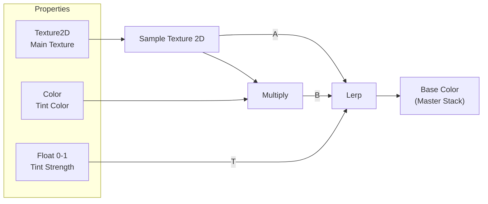

**Build Steps:**
1. Create Unlit Shader Graph
2. Add properties: Main Texture (Texture2D), Tint Color (Color), Tint Strength (Float, 0-1)
3. Sample Texture 2D → Multiply with Tint Color
4. Lerp: A = Sampled Texture, B = Multiplied result, T = Tint Strength
5. Output to Base Color

**Stretch Challenge:** Add second Color property "Alt Tint" and a Tint Blend slider to control which color is used.

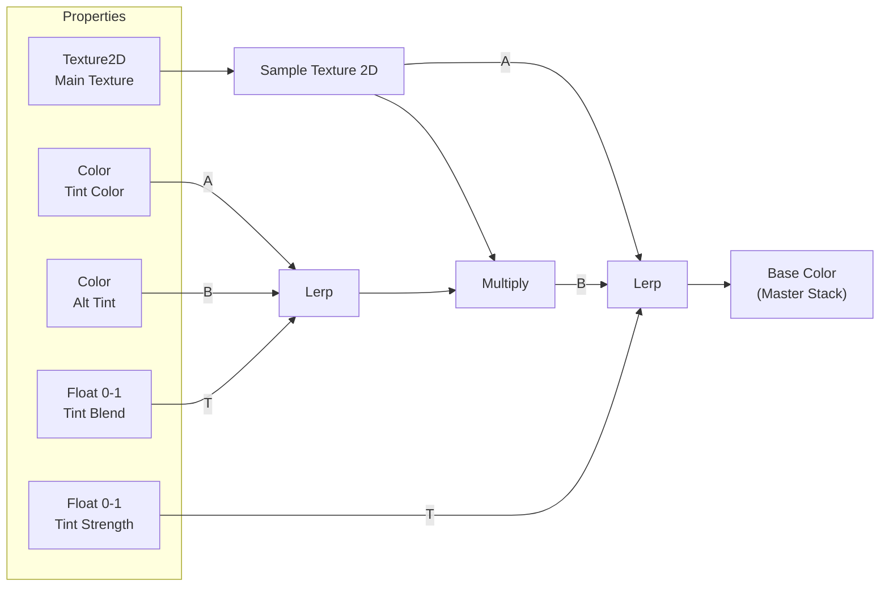

---

## Shader 2: Snow Accumulation (30 min)

**Use cases:** Weather systems, environment variation, moss/dust effects

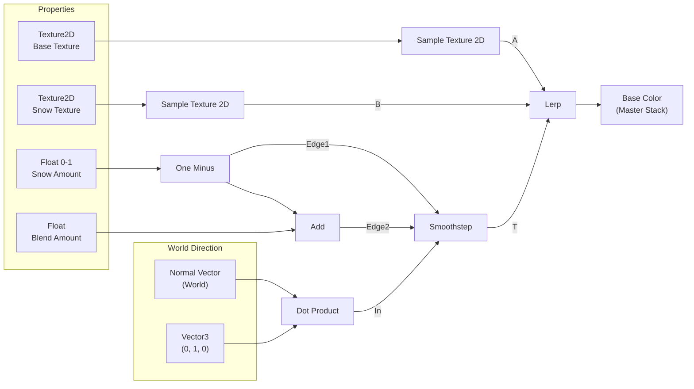

**Build Steps:**
1. Create Unlit Shader Graph
2. Add properties: Base Texture, Snow Texture (Texture2D), Snow Amount (Float, 0-1), Blend Amount (Float, default ~0.1)
3. Sample both textures
4. Normal Vector (World) → Dot Product with Vector3 (0, 1, 0)
5. One Minus on Snow Amount
6. Smoothstep: Edge1 = One Minus, Edge2 = One Minus + Blend Amount, In = Dot Product
7. Lerp: A = Base Texture, B = Snow Texture, T = Smoothstep
8. Output to Base Color

**Stretch Challenge — Angled Snow:** Add a Snow Direction property to control wind-blown snow.

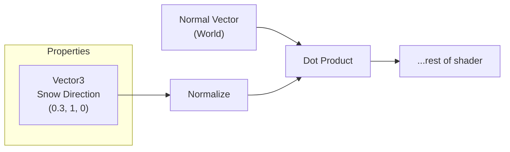

---

## Bonus: Damage Mask (10 min)

**Use cases:** Artistic damage control, wear patterns, painted effects

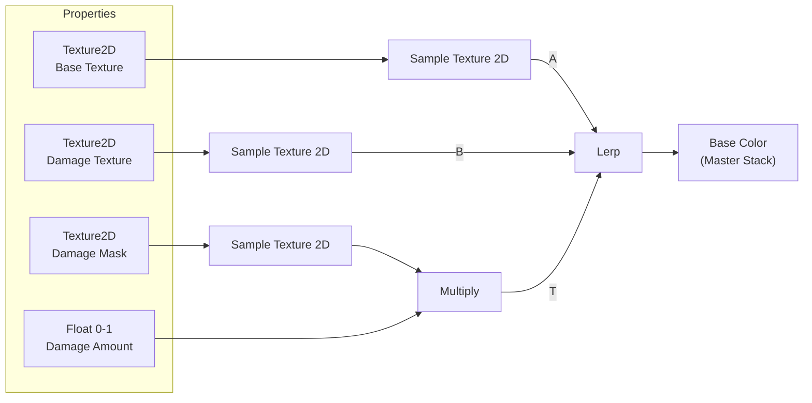

**Build Steps:**
1. Extend Color Tint shader (or create new)
2. Add properties: Base Texture, Damage Texture, Damage Mask (Texture2D), Damage Amount (Float, 0-1)
3. Sample all three textures
4. Multiply: Mask × Damage Amount
5. Lerp: A = Base Texture, B = Damage Texture, T = Multiply result
6. Output to Base Color

---

## Shader 3: Scrolling Water (35 min)

**Use cases:** Rivers, lava, conveyor belts, energy effects

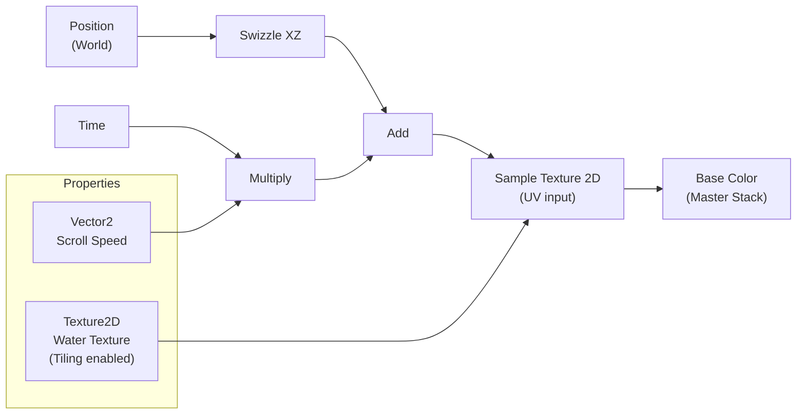

**Build Steps:**
1. Create Unlit Shader Graph
2. Add properties: Water Texture (Texture2D, enable Tiling), Scroll Speed (Vector2, default 0.1, 0.05)
3. Position (World) → Swizzle to XZ
4. Time × Scroll Speed
5. Add: Position XZ + Time result
6. Connect Add to Sample Texture 2D UV input
7. Output to Base Color

**Stretch Challenge A — Separate Scroll Speeds:**

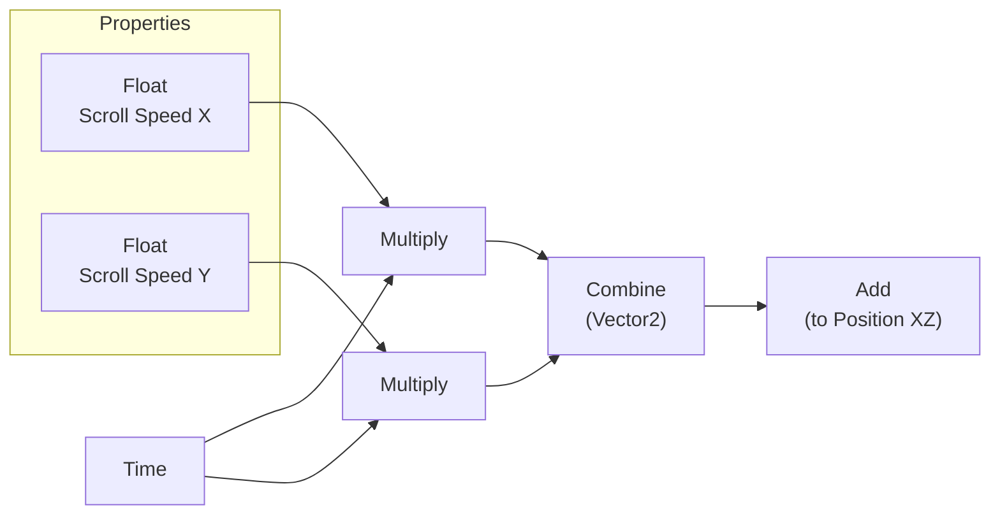

**Stretch Challenge B — Foam Overlay Layer:**

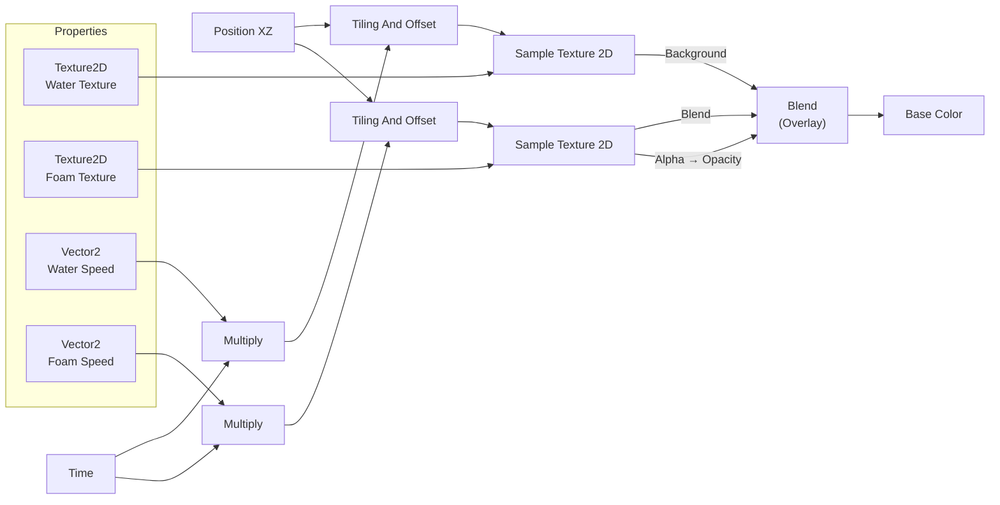

---

## Shader 4: Dissolve Effect (35 min)

**Use cases:** Spawn/despawn, teleportation, death effects, magic

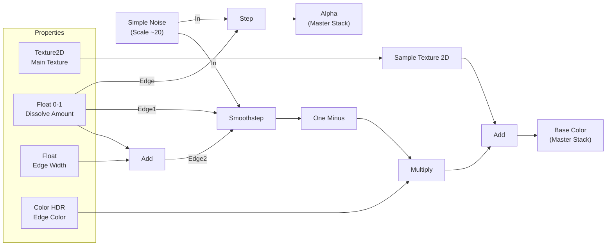

**Build Steps:**
1. Create Unlit Shader Graph, enable Alpha Clipping in Graph Inspector
2. Add properties: Main Texture (Texture2D), Dissolve Amount (Float, 0-1), Edge Width (Float, ~0.05), Edge Color (Color, HDR)
3. Sample Main Texture
4. Simple Noise (Scale ~20)
5. Step: Edge = Dissolve Amount, In = Noise → Alpha output
6. Smoothstep: Edge1 = Dissolve Amount, Edge2 = Dissolve Amount + Edge Width, In = Noise
7. One Minus → Multiply with Edge Color
8. Add glow to sampled texture → Base Color output

**Stretch Challenge A — Animate with Sine:**

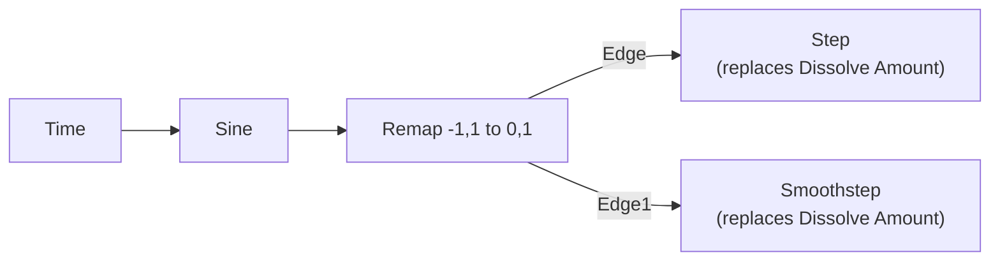

**Stretch Challenge B — Different Noise Patterns:** Replace Simple Noise with Gradient Noise or Voronoi for different dissolution patterns.

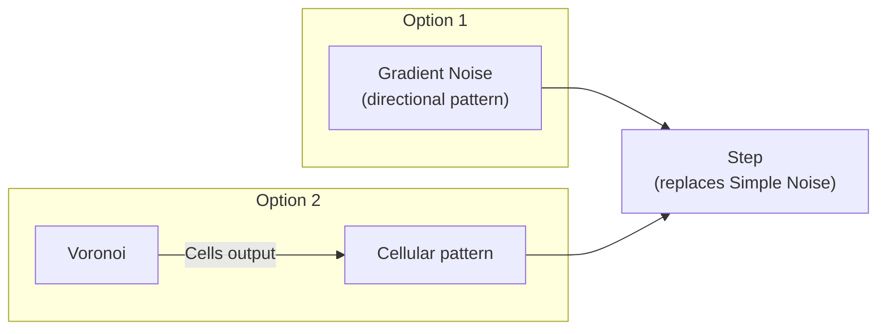

---

## Shader 5: Rim Highlight (10 min) — Stretch Goal

**Use cases:** Selection highlight, magical auras, stylized lighting

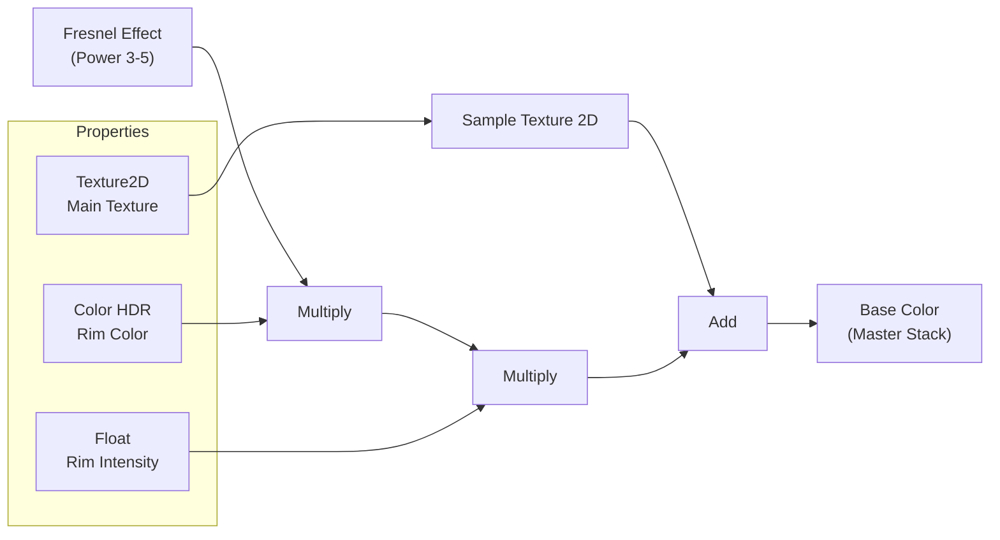

**Build Steps:**
1. Create Unlit Shader Graph
2. Add properties: Main Texture (Texture2D), Rim Color (Color, HDR), Rim Intensity (Float)
3. Sample Main Texture
4. Fresnel Effect (Power 3-5)
5. Multiply: Fresnel × Rim Color × Rim Intensity
6. Add to sampled texture → Base Color output

**Stretch Challenge — Pulsing Rim:**

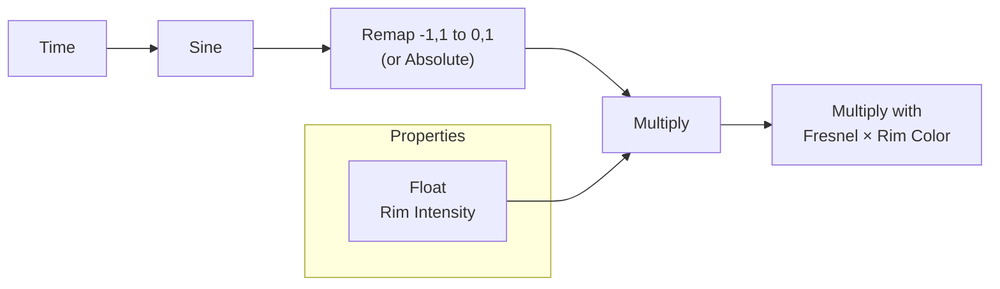
